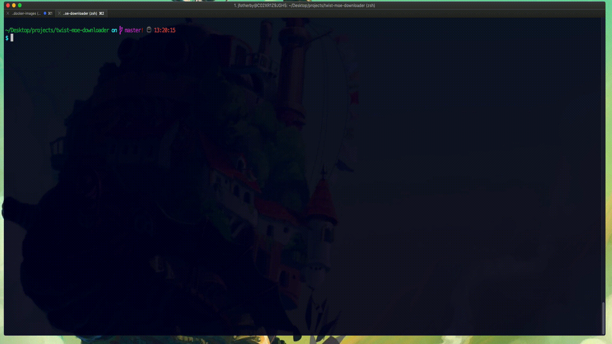

# Twist.Moe Downloader Helper

### Description


This is a small python tool for downloading video contents of series available on the website `twist.moe` locally. 
To download a particular series, find the title as defined in twist.moe's url string. 
i.e. `https://twist.moe/a/made-in-abyss/` would need the argument passed as `made-in-abyss`.

Remember to support twist.moe with donations if you can, as they do a great job of operating their site!

### Installation
The associated scripts run in python version 2.7 and has not been tested in python 3. Simply install the 
`requirements.txt` to complete installation. I encourage you to use a virtualenv here if you can.

```bash
$ git clone https://github.com/JFryy/twist-moe-downloader.git
$ cd twist-moe-downloader
$ sudo pip install -r requirements.txt
```

And you're done! You can started with something as simple as the command below.

`$ python twist-dl.py download shingeki-no-kyojin`

### Running the script

```bash
$ python twist-dl.py
usage: python twist-dl.py search [title] / download [title] [--directory DIRECTORY] [-h]

Twist-dl is a small python tool for downloading video contents of series
available on the website twist.moe locally! To download a particular series,
find the title as defined in twist.moe's url string. i.e. 'https://twist.moe/a
/made-in-abyss/' would need the argument passed as 'made-in-abyss'. Optionally
searching can be enabled for searching through twist.moe's catalog by using
the search command.

positional arguments:
  title

optional arguments:
  -h, --help            show this help message and exit
  --directory DIRECTORY
                        Directory path to save downloaded contents
  --range RANGE         Range of episodes to download. i.e. --range=1-24

```

### Example Usage:

#### Search
Use the search command to retrieve the title name for downloading:
```bash
$ python twist-dl.py search shingeki-no-kyojin
title                              | created_at          | updated_at          | id
-----------------------------------+---------------------+---------------------+-----
shingeki-no-kyojin                 | 2016-08-14 12:50:06 | 2016-08-14 12:50:06 | 657
-----------------------------------+---------------------+---------------------+-----
shingeki-no-kyojin-season-2        | 2017-04-01 20:59:42 | 2017-04-01 20:59:42 | 1019
-----------------------------------+---------------------+---------------------+-----
shingeki-no-kyojin-season-3        | 2018-07-22 23:20:00 | 2018-07-22 23:20:00 | 1508
-----------------------------------+---------------------+---------------------+-----
shingeki-no-kyojin-ova             | 2019-08-02 18:10:15 | 2019-08-02 18:10:15 | 2078
-----------------------------------+---------------------+---------------------+-----
shingeki-no-kyojin-lost-girls      | 2019-08-02 18:13:33 | 2019-08-02 18:13:33 | 2079
-----------------------------------+---------------------+---------------------+-----
shingeki-no-kyojin-kuinaki-sentaku | 2019-08-02 18:15:58 | 2019-08-02 18:15:58 | 2080
```

#### Download
Download by passing the series title as found from search. Not specifying a range with `--range` will download the entire contents of the series.
```bash
$ python twist-dl.py download shingeki-no-kyojin
https://twist.moe/api/anime/shingeki-no-kyojin/sources
Successfully gathered series information.
Downloading MP4s to Path: anime/shingeki-no-kyojin/ with episode range of 1-25
anime/shingeki-no-kyojin/shingeki-no-kyojin-episode-1.mp4:   4%|▎         | 24479/662939 [00:03<01:02, 10219.80KB/s]

```
##### Disclaimer
Downloading copyright videos may be illegal in your country. This tool is for educational purposes only.
